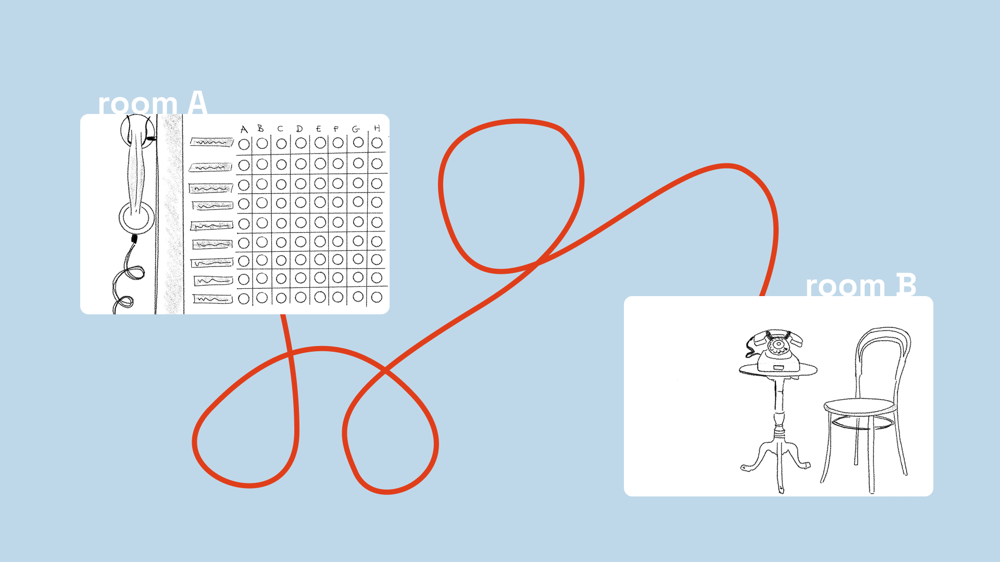
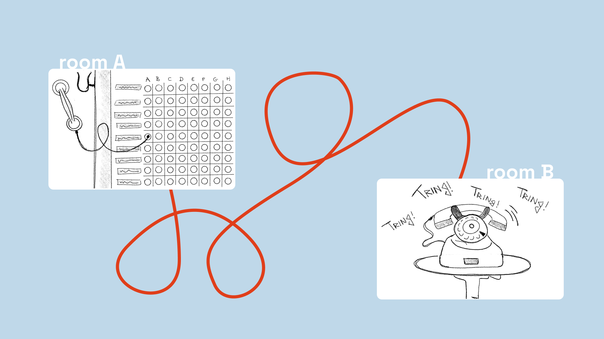
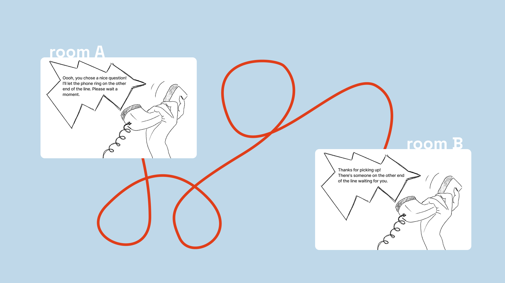
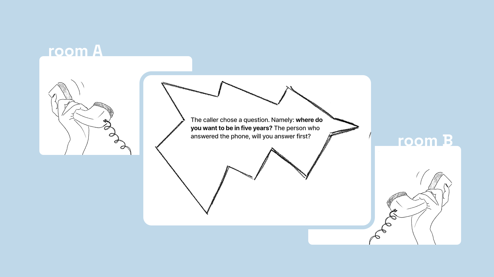
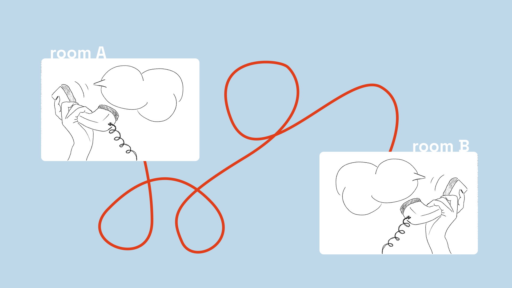
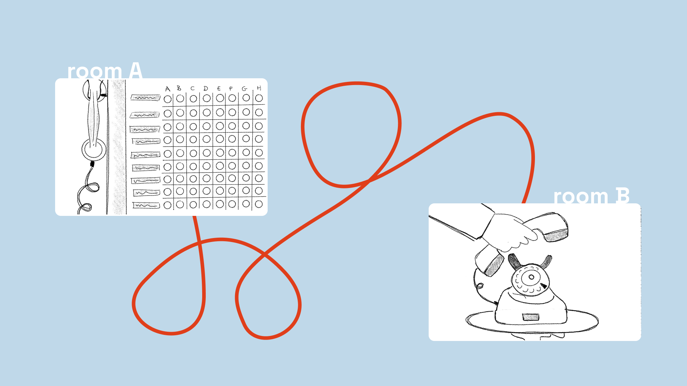

From my research question: *'How might we use obsolete technologies to break the smartphone bubble and facilitate meaningful micro-interactions between strangers?'*, I created a concept called: *[DIS]CONNECT*.

I want to build an installation for an exhibition or a museum, So the target audience will be broad: from young digital natives to older generations who remember a time before the screen.

My goal for the project is  really simple: let two strangers talk for just two minutes.

## Storyboard
So, what will this look like? I will be create an installation split into two different spaces within the exhibition.

In Room A, we have 'The Switchboard'. It will refer to the vintage manual telephone exchange. The kind with cables and plugs. The user here is the Operator. They see jacks labeled not with names, but with themes. To start, the Operator physically plugs the cable of the telephone into the topic of their choice.

At that exact moment, in Room B, a lonely, old-fashioned telephone starts to ring. A random visitor, the Receiver, hears it. Hopefully curiosity takes over. And they pick up.

And a warm voice-over connects them. It tells the Oparator: ‘Ooh, you choose a nice question, I'll let the phone ring on the other end of the line, please wait a moment’ It tells the Receiver: ‘Thanks for picking up! There's someone on the other end of the line waiting for you.' And for both the voice-over will tell the choosen question.

For the next two minutes, two strangers share a small, unrecorded moment. If there is a long silence, or the time is up, the Voice Over gently intervenes to end the call.

