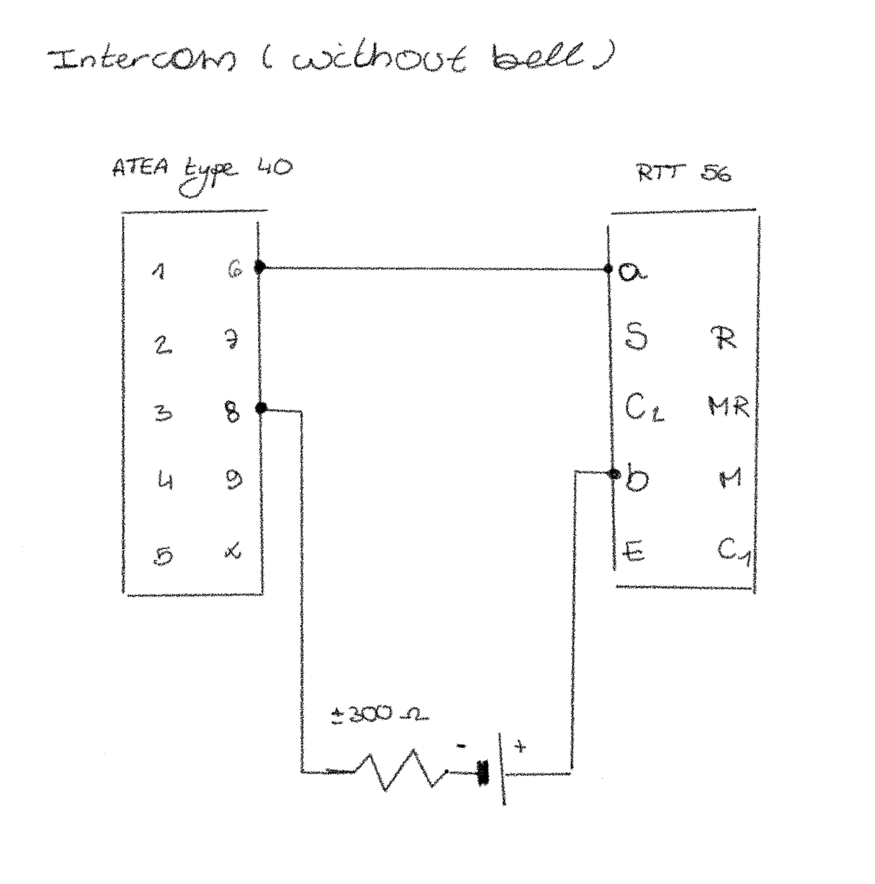
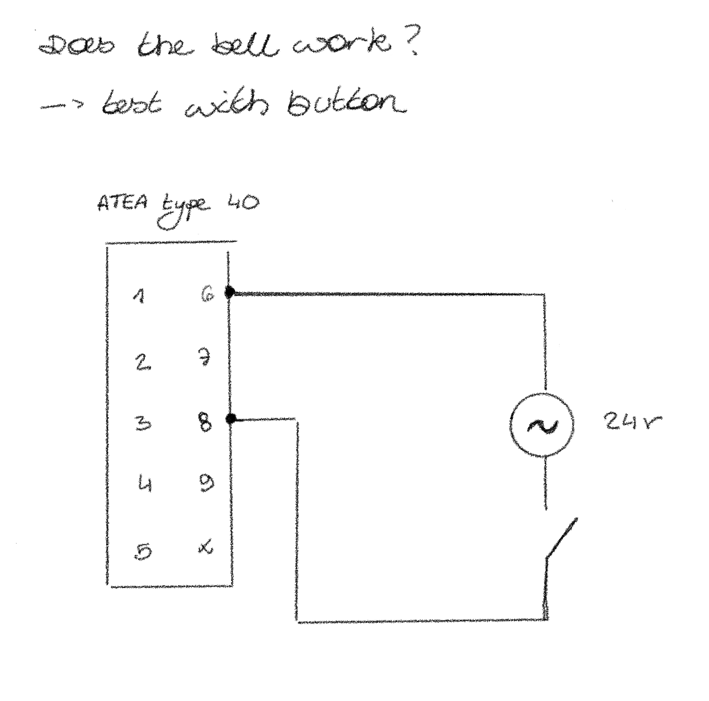

import resistanceVideo from '../../assets/videos/20260106-resistance.MOV?url';
import ringVideo from '../../assets/videos/20260106-ring.MOV?url';

## Creating an intercom
Today I will create an intercom. By making this intercom I can check if the old rotary phones are still working. In my last post, I mentioned that these phones were originally powered by 48V DC, but I found out they can actually run on a much safer 9V battery. By creating a simple circuit with two phones and a 9V battery, you basically get a intercom.

But before I started plugging things in, I had to do some measuring.

### The resistance of a phone
I saw a video of someone building a similar setup, and they started by measuring the resistance of the phones. I grabbed my multimeter and did the same.

Here is what I found:

**ATEA Type 400:** This one was easy. It measured 0.3 k𝛺 when the horn was off the hook (off-hook) and ∞ (infinity) when the horn was on the hook.

**RTT 56B:** This one was a bit weird. At first, it measured 1.5 k𝛺 off-hook. But after I turned the rotary dial once, the resistance "reset" to 0.3 k𝛺 off-hook and ∞ on-hook.

It seems the old internal contacts just needed a little movement to wake up

#### What do these numbers actually mean?
**∞ 𝛺 (On-hook):** This means the circuit is open. No electricity can flow through the talking part of the phone. In this state, the current is waiting to be sent to the bell circuit instead.

**0.3 K𝛺 (Off-hook):** This means the circuit is closed. The resistance is low enough that electricity can now flow through the microphone and speaker.

Essentially, "Off-hook" is like flipping a light switch to "ON." Once I saw that 0.3 k𝛺 on both phones, I knew the internal wiring was healthy enough to carry a voice.

### The circuit
I connected the two phones in a loop with a 9V battery. I also added a 300𝛺 resistor in series, which is super important: it limits the current so I don't "fry" the old carbon microphones, and more importantly, it acts as an audio bridge. Without that resistor, the battery would actually "eat" the voice signal and you wouldn't hear anything.

<video width="100%" height="600" controls>
  <source src={resistanceVideo} />
</video>

### Let's test it!
I built the circuit, and... sadly, all I heard was a crispy, hissing sound.

Apparently, that noise was actually a good sign! It meant the circuit was alive. As I mentioned before, the microphones use carbon granules, but over the years, these tiny grains can stick together. When they don't move, you don't get any sound, just a static noise.

Fixing them wasn't actually that hard. I just had to get them moving again. After some shaking of the handset and a bit of screaming into the mouthpiece (sorry to everyone who was on campus at the time), the granules finally loosened up.

And voilà, I could finally hear my voice coming through the other phone!

## Ring the telephone
Since I had some time left today, I decided to try and ring the telephone. As I mentioned in my last post, old rotary phones usually use Alternating Current (AC) at a voltage between 60V and 90V to ring. Since those voltages are really high, I decided to use a transformer that creates a 24V AC output instead.

I just touched the wires together by hand and... the bell of my RTT 56 started ringing!

Next, I wanted to see if I could make the other phone ring as well. But suddenly, electrical sparks started flying from the connection between the two wires...

### An old paper-in-oil capacitor...
All the components of an old phone are very robust and endure the time, but one component doesn't: the paper-in-oil capacitor. It's the core of the phone's electrical circuit, and over time it just became a conductor. So what I did was connecting the + directly to the - of my circuit and i created a short circuit. Luckly, nothing was broken and after I changed the old capacitor to a new one (WIMA MKPA10 I 1µF 630VDC 400VAC), the phone started ringing!

<video width="100%" height="600" controls>
  <source src={ringVideo} />
</video>
