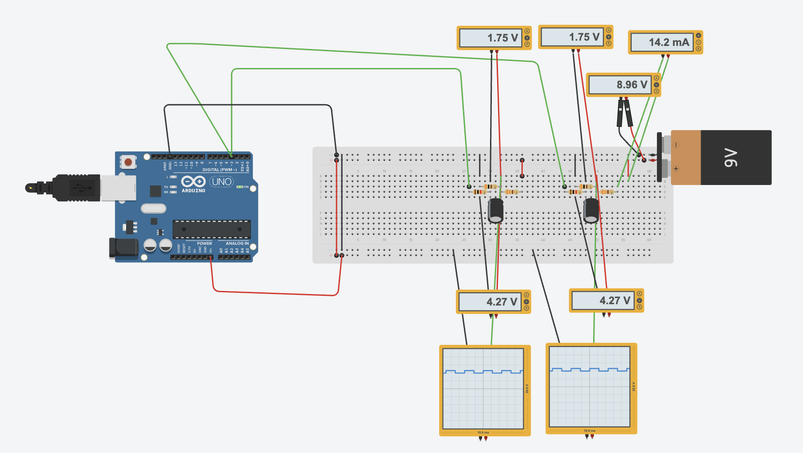
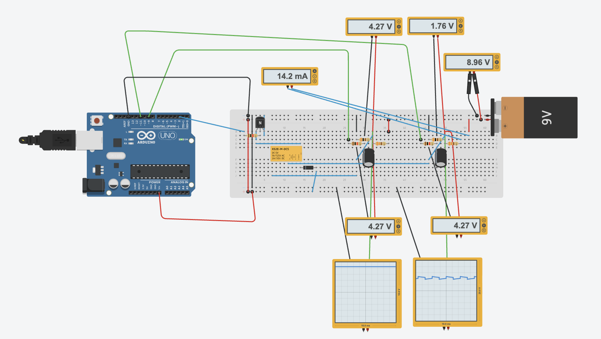

I managed to fry an Arduino and a handful of capacitors... all because a resistor was actually 0Ω instead of the 300Ω I needed.

But hey, the day wasn't a total loss! By the end, I had:

A simulation where an Arduino feeds different sounds into my two telephones.

A simulation combining the audio circuit and the direct-talk circuit, regulated by a relay.

I also tried to simulate the bells, but that failed for now. I’ll have to give that another shot another time!

## sound loop, no connection between phones

This circuit exist out of a arduino, the telephone (represented as a resistance of 0.3kΩ), a capacitor, and 2 resistors (one of 330𝛺 and one of 1k𝛺). The 1k𝛺 resistor is used to limit the current to the arduino, and the 330𝛺 resistor is used to set the volume. Picking a heavier resistor will result in a lower volume.
The capacitor acts like a sort of wall. It blocks the DC current, but allows the AC current, that creates the sound, to pass.

<a href="https://www.tinkercad.com/things/2BNsrL1ljib-sound-loops-arduino-no-connection-between-phones" target="_blank">Find the simulation here -></a>

## sound loop, connection between phones

To connect the two phones and allow the Arduino's audio to pass through, I added a relay to merge the sound loop with the intercom circuit.

<a href="https://www.tinkercad.com/things/3fBIcnZGZkq-copy-of-sound-loops-arduino-connection-between-phones" target="_blank">Find the simulation here -></a>
