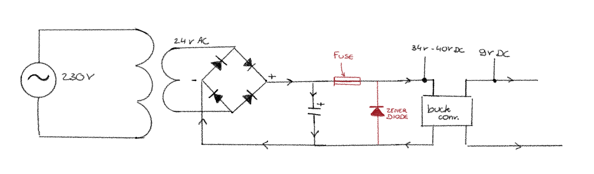

## Creating a Shopping List
The first step of the day is creating a shopping list. Otherwise, I would end up at the electronics shop every single day.

### From 230V AC to 9V DC
Since my bells ring on AC and the talking loop of my phone works on 9V DC, and I don’t want to deal with multiple sockets or batteries, I need to create a circuit that can convert 230V AC to 9V DC.

#### Step 1: Stepping down the voltage 230V AC -> 24V AC
I want to power my project from a standard wall socket (230V AC). To step down the voltage, I need a transformer. I’m using an Ezviz EZ030 transformer.

#### Step 2: Rectifying the voltage
To convert the AC to DC, I need a bridge rectifier. After the bridge rectifier, the voltage looks like a series of "little arches." To turn that into a constant, straight line, I added a capacitor. Now, my output is 34V DC. That is way too high for what I need!

#### Step 3: Regulating 34V DC down to 9V DC
##### Idea 1: Using voltage regulators
Dropping the voltage from 34V DC (or higher, as that is the power after the bridge rectifier and capacitor) down to 9V DC is a lot. Using just one linear voltage regulator wouldn't be enough because it would get too hot. I tried making a cascade of different voltage regulators, and while this would work, the heat management would still be a problem.

##### Idea 2: Using a buck converter
Luckily, there is a component called a buck converter that can do the job perfectly in one piece. I’m using an LM2596S. However, there is one big issue: the maximum input voltage of this converter is 40V. My rectified voltage is very close to that limit, especially when there is no load on the circuit, as the voltage can spike to nearly 40V.

To make sure I don't burn out the buck converter, I would normally need to add a Zener diode and a fuse. For now, I’ve simply chosen to switch the output voltage of my transformer to 12V AC to keep things safe.

### The talking circuit + arduino
To make the talking circuit work, I need:
- a 5V relay
- a 1N4148N diode or a 1N4007 diode
- a transistor NPN BC337

The transistor handles the higher current needed by the relay, while the diode protects the components from damaging back-EMF voltage spikes (a high-voltage spike that occurs when the power to an inductor (like the coil inside a relay) is suddenly cut off).

## Building the arduino sound circuit
Now I have all the needed components, I can start building my sound circuit. The first thing I wanted to test was if I actually can play some music from my arduino into my phone. Everything about sending sound from my arduino to the phones is writen down in this [post](www.janaelst.be/passionProject/blog/20260110-music/).

But at the end of today I could play 2 seconds of music!