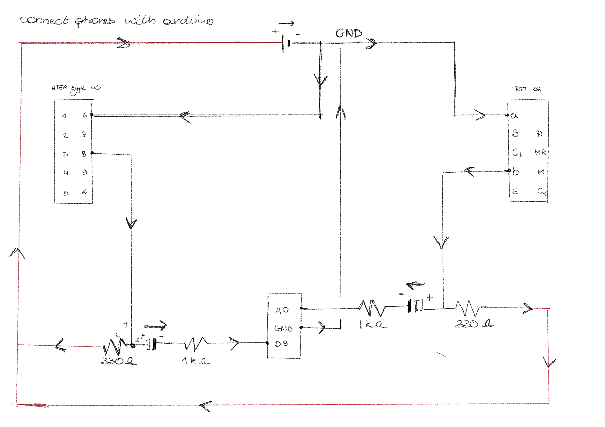

import twoSeconds from '../../assets/videos/20260110-twoSeconds.MOV?url';
import oneSong from '../../assets/videos/20260110-oneSong.MOV?url';

## The circuit

## Create a constant tone
The first thing I did was to create a constant tone. Hierdoor kon ik checken of de arduino geluidsignalen naar de telefoon kon sturen. Guess what? It worked!

However, playing a different sound signal on each phone did not work. The library I was using could only play one tone at a time. Something to worry about later!

<a href="" target="_blank" class="link-end">Find the code here -></a>

## Play 2 sec of music
The next step instead of just playing a constant tone, I wanted to play some music. Sadly an arduino don't have that much memory. So I only could play 2 seconds of music. To play the music, you need to be sure the arduino can actually read it. So you need to convert it, therefor I used "Audacity".

The steps I took:
1. shorten the music to 2 seconds
2. export the music with the following settings:
- .wav file
- 8 bit
- 8000 Hz
- Mono
3. from wav to hex (using the [FileToCArray tool](https://notisrac.github.io/FileToCArray/))
4. add hex into the arduino code

<a href="" target="_blank" class="link-end">Find the code here -></a>

<video width="100%" height="600" controls>
  <source src={twoSeconds} />
</video>

## Play 1 song
In the end, I didn't want to be limited to only two seconds of sound. I want to play various voice messages and instructions, so I definitely need more storage than that.

To solve this, I added a micro SD card reader to my Arduino to expand its memory. And now, my phone is playing a whole song!

<a href="" target="_blank" class="link-end">Find the code here -></a>

<video width="100%" height="600" controls>
  <source src={oneSong} />
</video>

## Play a different song on each phone
Now that I can play one song, you'd think playing different songs on each phone would be easy. But it really isn't. Between the Arduino's limitations and the buffering, it’s just not working that well yet. I’ve decided to put the coding on hold for a moment. I want to ensure the hardware is 100% perfect first.

<a href="" target="_blank" class="link-end">Find the code here -></a>

At the moment I was just running tests to see of my hardware setup was working. All of the code is made with Gemini Pro.

