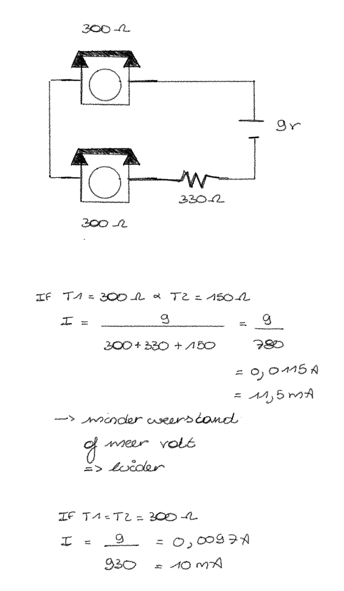
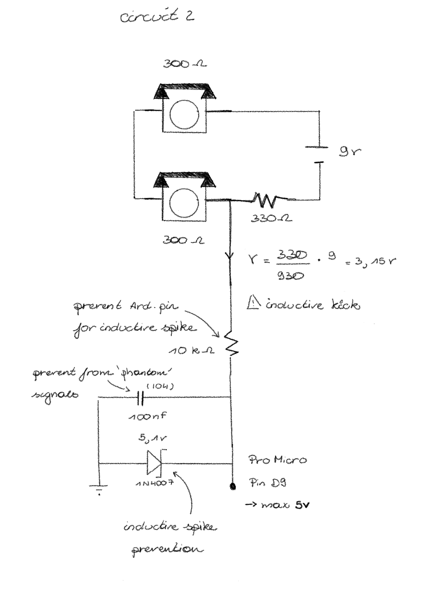
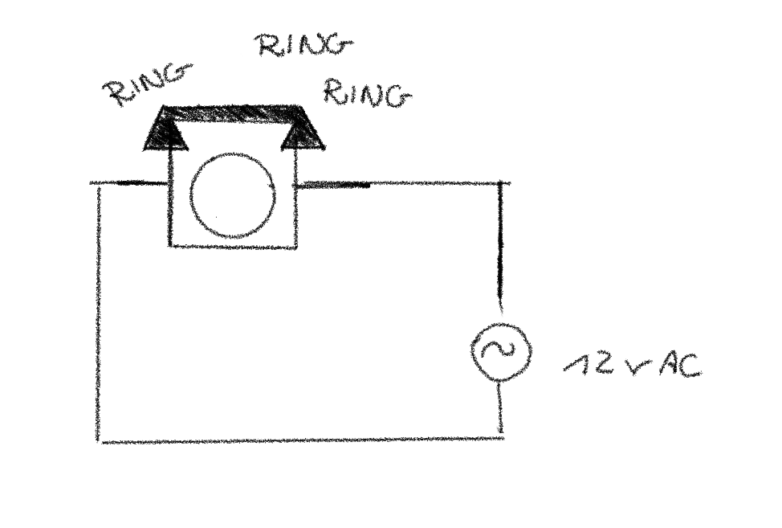
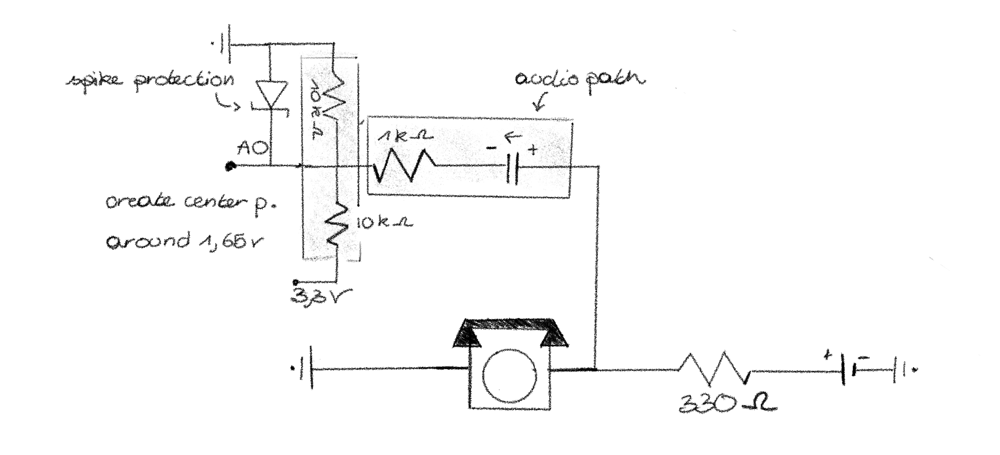
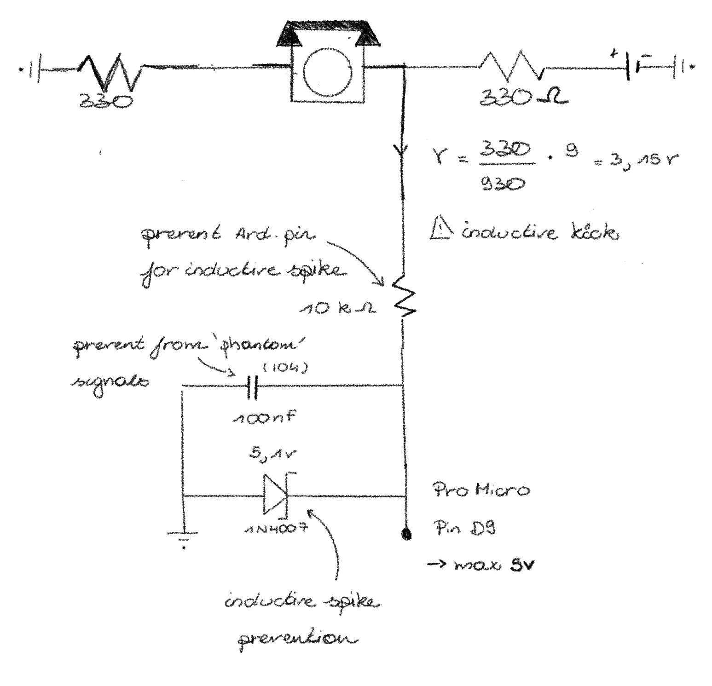
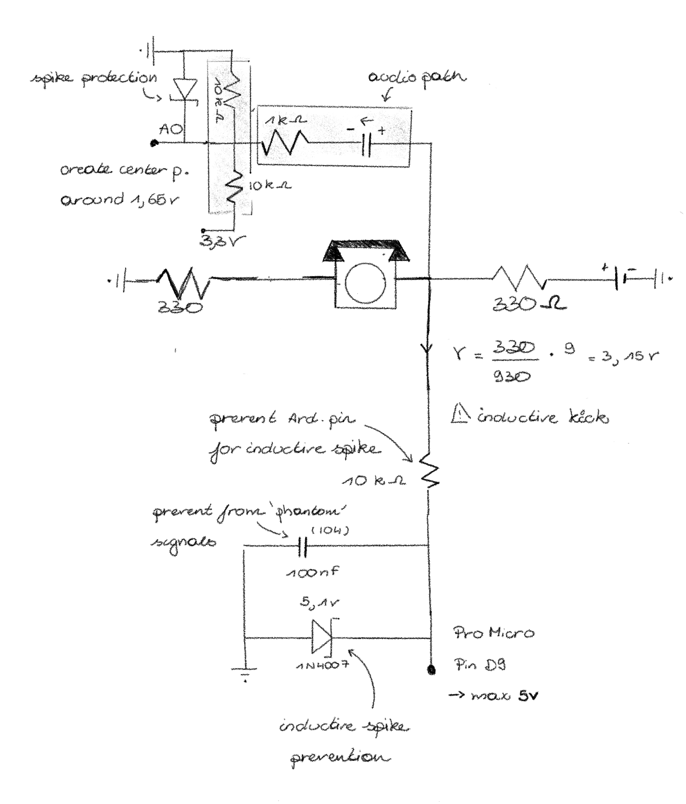
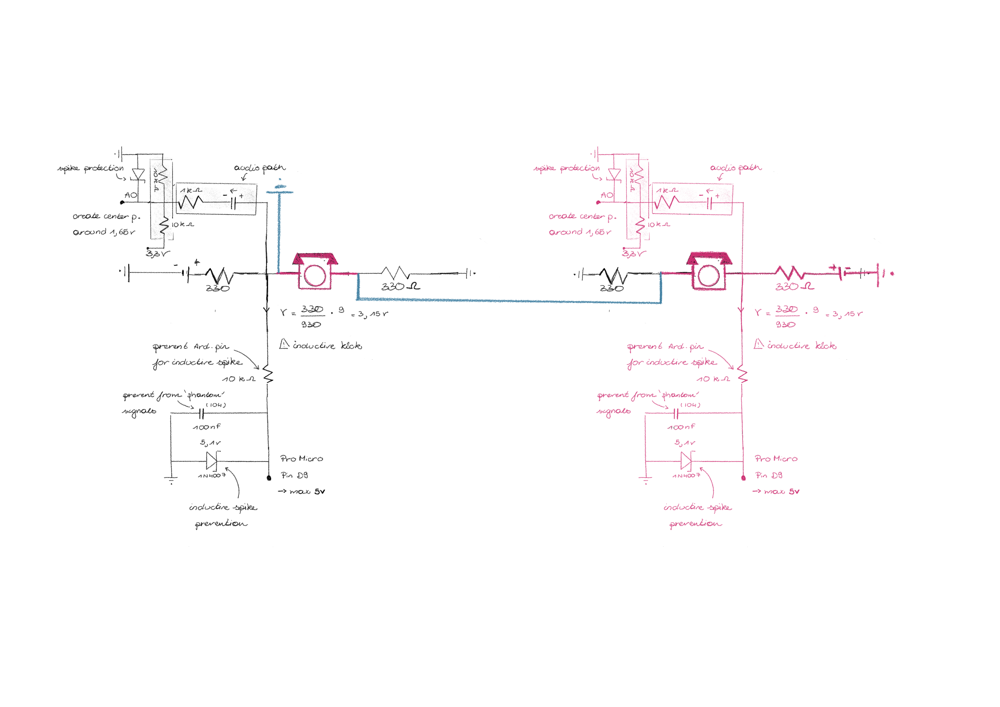

So, last two weeks I made a lot of circuit, wrote some code and connected it to an Pi. This week I want to start coding everything, but ... my wiring isn't working if everything is connected. To know what I was doing, what is wrong at the moment, I decided to break my whole circuit into small parts.

## Goal
I want to make a installation where two people can talk to each other by the use of two old rotary phones. I don't want to manipulate the internal circuit of the phones, so basically I'm making a kind of telephone exchange. At some moments an Arduino should infuse sound trough one or both of the phones.

### State 1: talking mode
**Phones are just like an intercom**
- both phones are connected to each other.
- it should be possible to detect if one of the phones is on hook.
- if one of the phones is on hook, the circuit should change to state 2 (sound infusing mode)

### State 2: sound infusing mode
**Every phone can hear an other sound**
- the phones are disconnected from each other.
- each phone is connected to an arduino.
- it should be possible to detect the on/off hook state of each phone.
- it should be possible to see what number is dialed on each phone.

**Voice mail - recording**
If the other phone isn't picked up. It should be possible to play and record a voice mail.
- It should be possible to record a sound

### State ???: ring
**The phone rings when it is needed**
I also want that one of the phones rings when it is needed, this signal will be sent from the arduino to the phone.
But how? The bell is working on AC current, while the arduino and all the other things are working on DC current. So connecting this in a wrong way will damage the arduinos.

## Technical specs
- An old rotary phone works on a current of 20mA to 30mA.
- The internal resistance of the phone is around 300 ohms or 0.3K ohms.
- There can occur peak voltages during ringing of the phone, dialing a number, or when the phone is changing from off/on hook.

- I will use 3 arduino's:
    - **1 Pro Micro (5V)**: used for all the logic and detections
    - **2 Nano IOT (3.3V)**: both used as Digital-to-Analog converter and Analog-to-Digital converter

## Circuits
I made a lot of circuits to test different things. I will list and explain them all.

### Circuit 1: Intercom
With this circuit you can have a conversation between phone 1 and phone 2.

<div class="image-center">



</div>

### Circuit 2: Intercom, with on/off hook detection
With this circuit you can have a conversation between phone 1 and phone 2. It also detects if one of the phones is on hook.

This detection is done by the Pro Micro (5V).

<div class="image-center">



</div>

````
void setup() {
  pinMode(9, INPUT);
  Serial.begin(9600);
}

void loop() {
  int val = analogRead(0);
  if (val < 10) {
      Serial.println("ON HOOK");
  } else {
      Serial.println("OFF HOOK");
  }
}
````

### Circuit 3: Separate phone, ring signal
This circuit let one phone ring. To let the phone ring, you need a AC signal. By using a AC current the electromagnet will switch polarity, which will make the hammer moving and the bell ring.

<div class="image-center">



</div>

### Circuit 4: Separate phone, sound infusing with arduino (and Pi)
With this circuit you can play a sound through one phone. The sound is generated by the arduino. But in the final product, the sound will be sended from a pi to an arduino Nano IOT (3.3V). This arduino is used as a Digital-to-Analog converter. The arduino then sends the signal to the phone.

<div class="image-center">



</div>

````
void setup() {
  pinMode(5, OUTPUT);
}

void loop() {
  tone(5, 425); // Only test Phone 2
}
````

### Circuit 5: Separate phone, detect on/off hook and dialing a number
While dialing a number, you send high short electrical pulses. If it is one short pulse, the user dialed a 1, if it is two short pulses, the user dialed a 2, and so on. If the phone is on hook, there will be no current flowing.

This detection is done by the Pro Micro (5V).

<div class="image-center">



</div>

````
const int phonePin = A0;

// thresholds based on your measurement
const int ON_HOOK_LIMIT = 200;   // Near 0
const int OFF_HOOK_LEVEL = 780;  // Your measured Off-Hook
const int PULSE_THRESHOLD = 500; // The "midway" point to detect a break

int pulseCount = 0;
bool isOffHook = false;
bool inPulse = false;
unsigned long lastPulseTime = 0;
const int timeout = 400; // If no pulse for 400ms, dialing is done

void setup() {
  Serial.begin(9600);
  Serial.println("Ready. Lift handset to start.");
}

void loop() {
  int val = analogRead(phonePin);

  // 1. Hook State Detection
  if (val > (OFF_HOOK_LEVEL - 100)) { 
    if (!isOffHook) {
      isOffHook = true;
      Serial.println("\n[OFF-HOOK]");
    }
  } else if (val < ON_HOOK_LIMIT) {
    if (isOffHook && pulseCount == 0) { // Only hang up if not currently dialing
      isOffHook = false;
      Serial.println("\n[ON-HOOK]");
    }
  }

  // 2. Pulse Detection (Only runs if handset is lifted)
  if (isOffHook) {
    // When dialing, the voltage drops from 780 towards 0 (the break)
    if (val < PULSE_THRESHOLD && !inPulse) {
      inPulse = true;
      pulseCount++;
      lastPulseTime = millis();
      Serial.print("."); // This is the dot you are seeing
    } 
    // Return to "Off-Hook" level ends the pulse
    else if (val > PULSE_THRESHOLD && inPulse) {
      inPulse = false;
    }
  }

  // 3. Digit Finalizer (The fix for the "only dots" problem)
  if (pulseCount > 0 && (millis() - lastPulseTime > timeout)) {
    int digit = (pulseCount == 10) ? 0 : pulseCount;
    Serial.print(" Digit: ");
    Serial.println(digit);
    
    pulseCount = 0; // Reset for next digit
  }
}
````

### Circuit 6: Separate phone, record voice mail
To record a voice mail, you need to change the Analog signal to a Digital one.

This will be done by the Arduino Nano IOT (3.3V), used as a Analog-to-Digital converter.

## Combined circuits
### Circuit 7: separate phone, sound infusing + on/off hook detection and dialing a number
**not tested in real life yet**

To make the whole circuit for a separate phone, I combined the circuit for the sound infusing with the circuit for the on/off hook detection and dialing a number.

<div class="image-center">



</div>

### Circuit 8: connection between separate phones and intercom
**not tested in real life yet**
To make it possible to switch between the separate phones and the intercom, I will need some relays, to break the circuit at some points.

For now i colored the common circuit pink, the extra wires for the intercom blue and the extra wires for the separate phones black.

<div class="image-center">



</div>

So by using relays the circuit becomes something like this: ???

### Circuit 10: separate phone + ring signal
Now during ringing the arduino cannot detect if the phone is on hook or off hook. So To make this still possible the bell will ring in intervals? Or are there other solutions?

### Circuit 11: connection between intercom and separate phones + ring signal

## Final circuit


