# The theory
Today I went to see Geert, an electronics teacher, who helped me sort out my messy circuits. After this major consult and gaining a lot of new insights, I started drawing my final circuit. I could have used professional software, but since I don't know which tools are good and which aren't, I just started drawing in Figma (very professional, I know ;-) ).

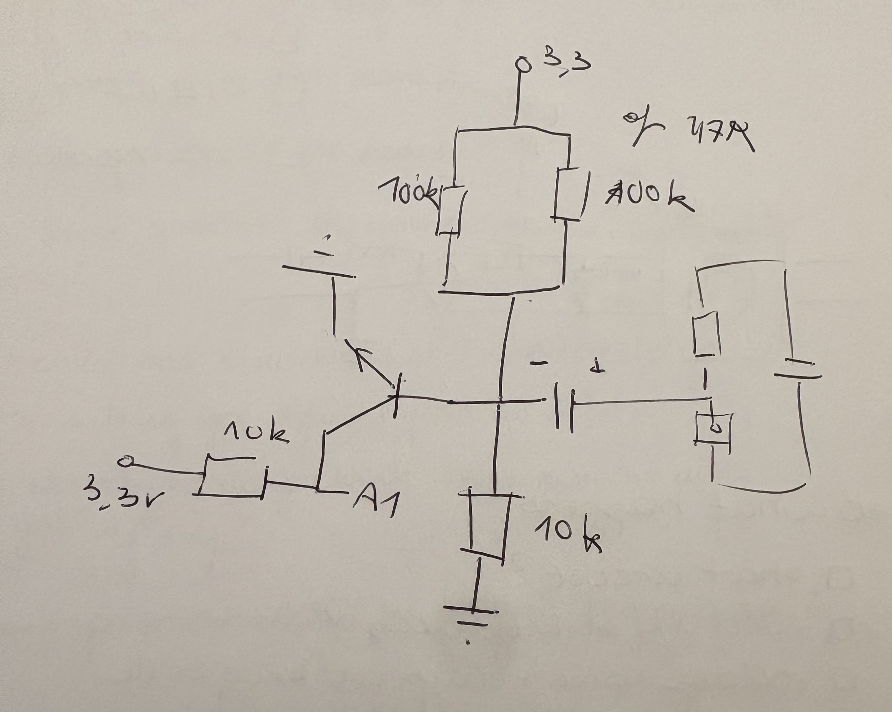

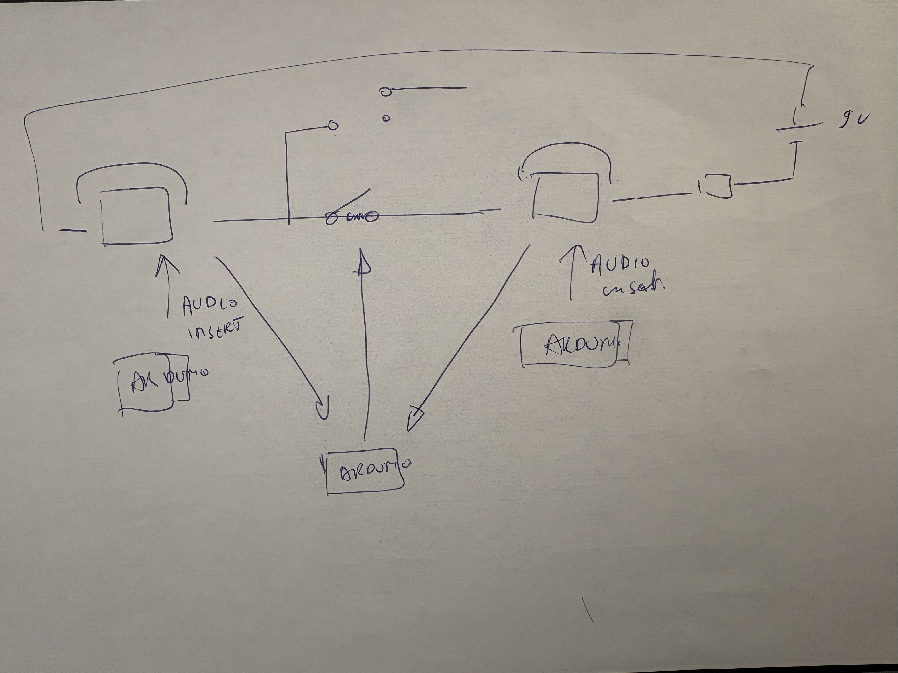

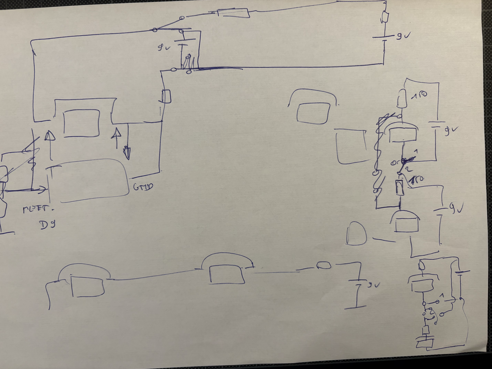

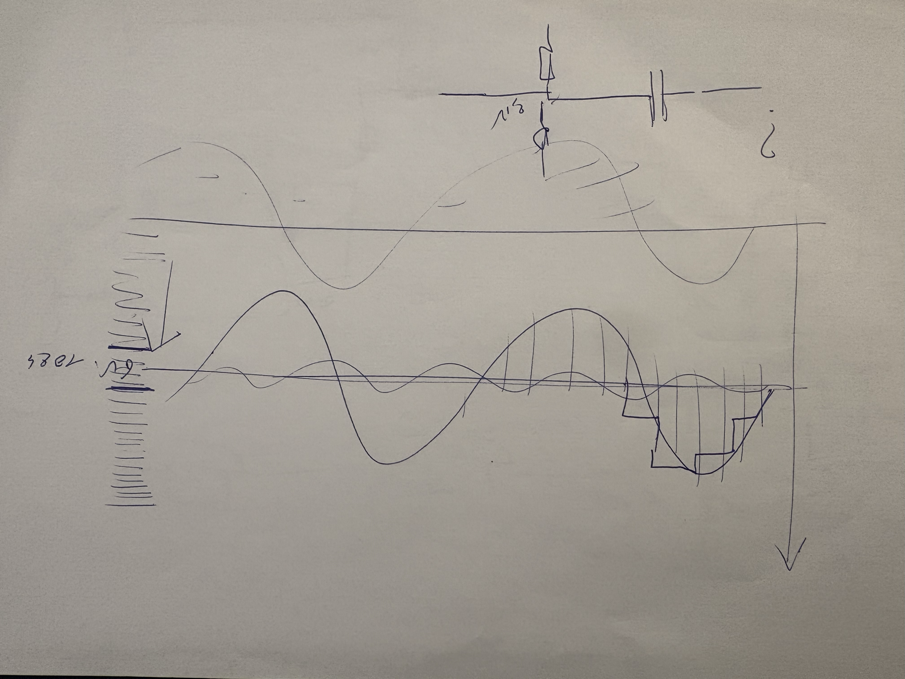

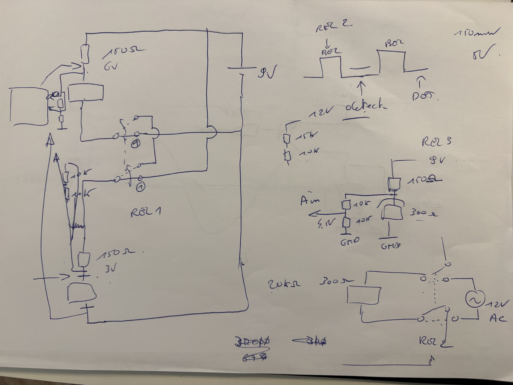

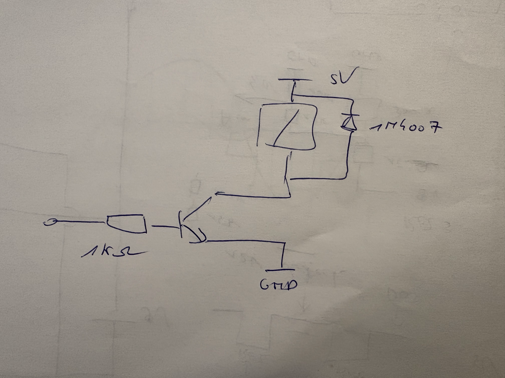

## But what did I learn today?
### Switching relays isn't that easy. 
Last week, my problems started when I had to connect the intercom circuit together with the sound infuse system. In the intercom circuit, the telephones are connected in series, while in the sound infuse system, the phones are connected in parallel. With some smart wiring, it finally worked out.

### A double-pole relay isn't the same as two single-pole relays.
The first step was taken: I could switch between the intercom and the sound infuse system. The next step was to let the bell ring. The bell works on AC instead of DC, so I had to switch between DC and AC, a really tricky thing to do. If you mess it up and your DC meets your AC, you can break everything. So, to let the bell ring without letting the AC meet the DC, you need to disconnect the phone from the DC circuit using a relay. More specifically, a double-pole relay. And no, you cannot fix it with two single-pole relays.

With two single-pole relays, you run the risk that one will open or close faster than the other. If that happens, the AC current can flow into your DC circuit. That's not what we want! A double-pole relay opens and closes the two switches at exactly the same moment, which is much safer.

## The circuit
### Step 1: Switching between intercom and sound infuse system
This was the hardest part of the circuit... By using a relays between the two phones, it is now possible to switch between the intercom and the sound infuse system. The two points that comes out of the circuit can now be used as measure points, or the record and infuse sound.

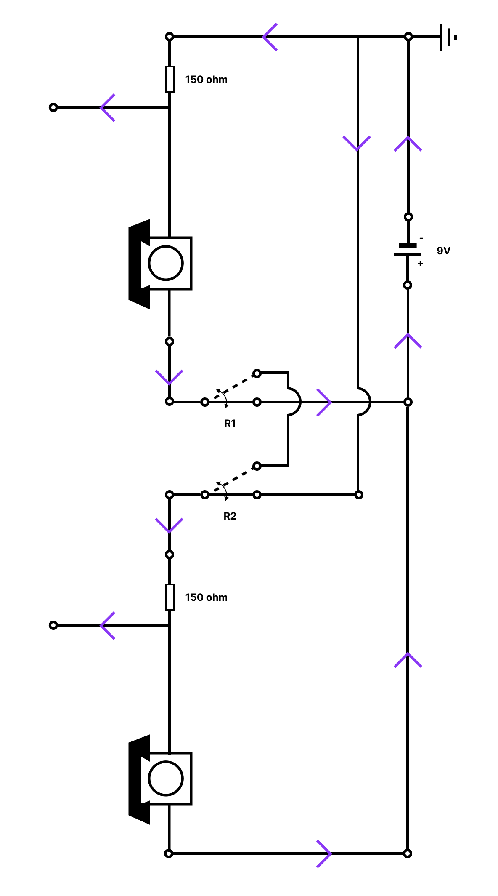

### Step 2: Add measurement on/off hook
Next up, measure if the phone is on or off hook, and which number the user has dialed. This measurement is done by the Pro Micro (5V). All those things could be measured by measuring the incoming voltage of the phone. But! The circuit of the phone is running on 9V DC, so, we need to power this voltage down to 5V DC, to protect the Pro Micro, by using a voltage divider. And now, or output voltage is 4.5 V DC.

Putting the phone back on hook, taking the phone off hook, or dialing a number, can cause a inductive spike. You don't want that this spike reach your Arduino, or it could potentially damage it. To prevent this, I added an extra resistor, that 'eats' the most of the spike and a zenderdiode. I also added a little capacitor to filter out the noise. And voila, you can measure if the phone is on or off hook, and which number the user has dialed.

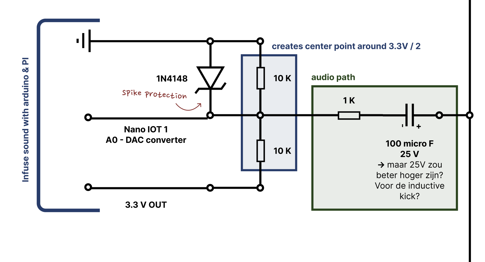

### Step 3: Add sound infuse system
I don't only want to check the status of the phones, I also want to play a sound through one of the phones. To do this, I added for each phone a Arduino Nano IoT (3.3V). I'm using this Arduino as a DAC, it even has a special pin to do this job.

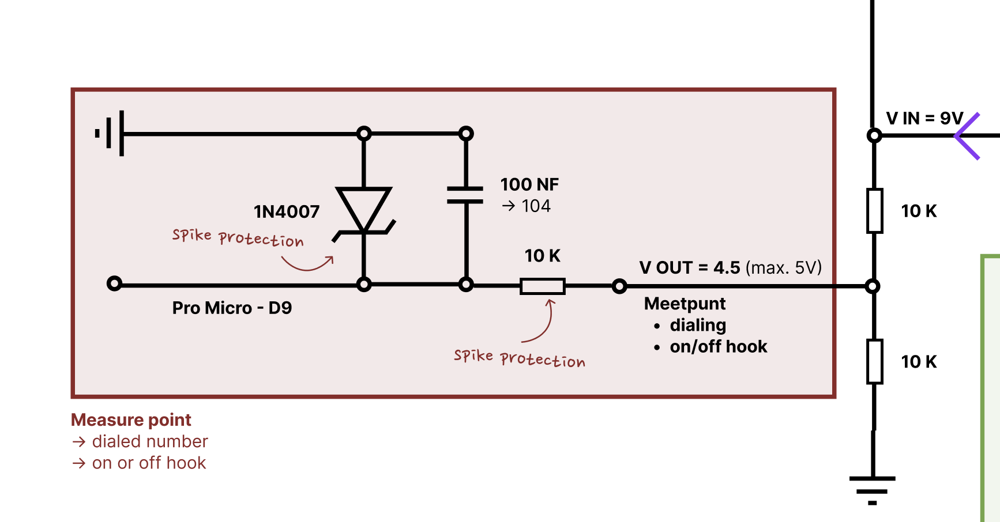

### Step 4: Add switching between AC & DC
To switch between AC and DC, I added a double pole relay.

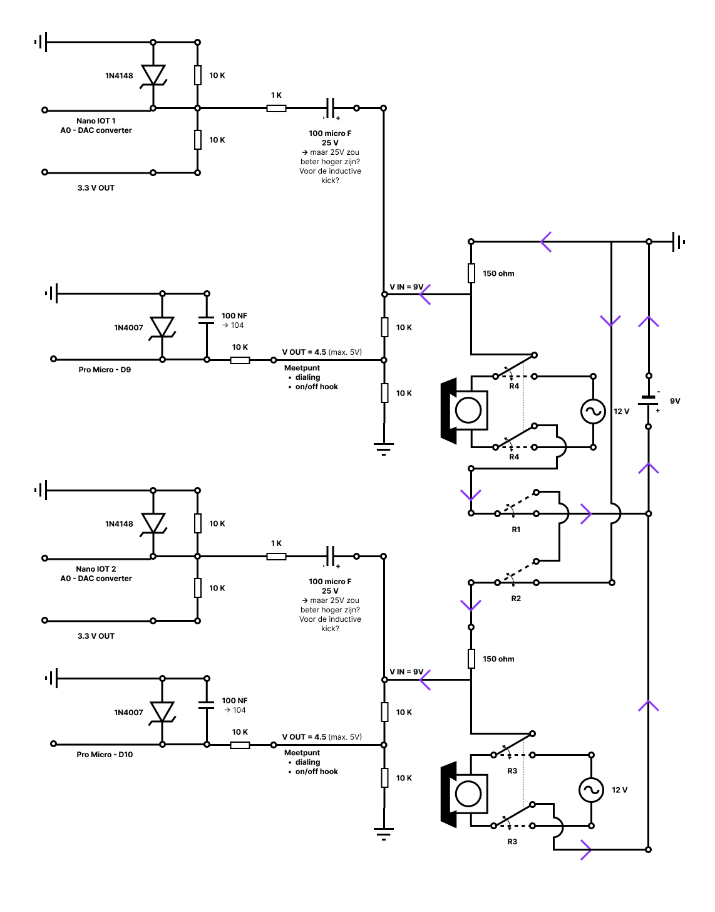

### Step 5: Connect to the transformer and the circuit
!!! Don't use this scheme, it will break your transformer (or potentially broke mine by using this scheme) [(read everything about it here)](/passionProject/blog/20260128-ring-the-bell)!!!

My thinking was that I had a transformer that stepped down the power from 230V AC to 12V AC, allowing me to tap the right current and power for each part of my circuit. But what looks beautiful on paper isn't always beautiful in real life... So, read [here](/passionProject/blog/20260128-ring-the-bell) what happened when I connected this part of my circuit.

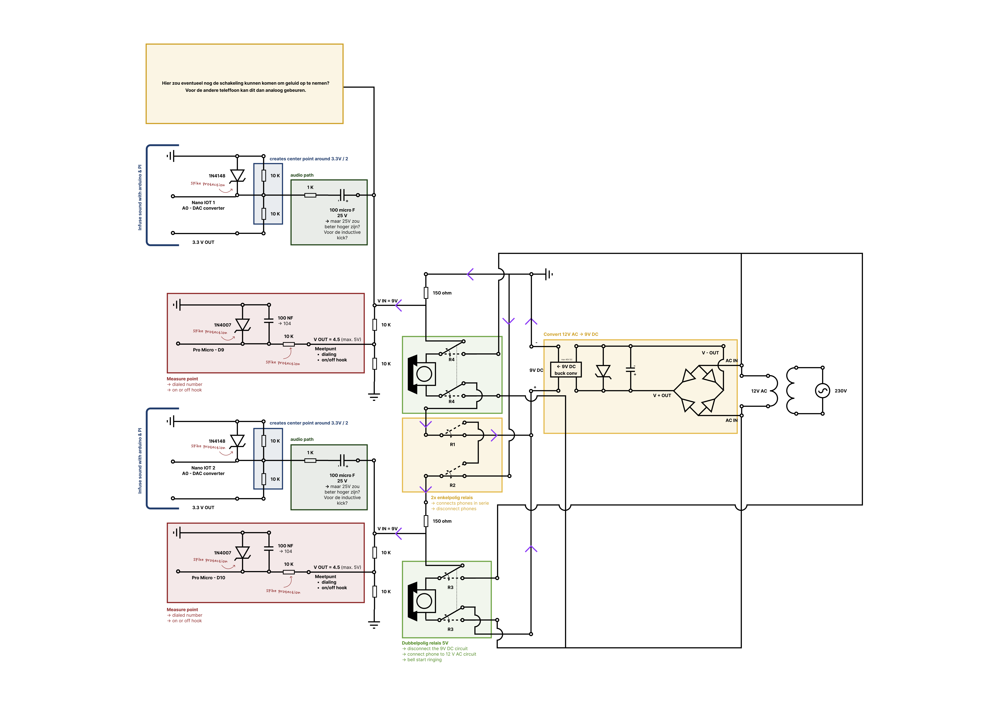

# Building it
Once I had drawn my entire circuit and clearly understood the design, I started building the 9V DC circuit. I had a moment of stress when I placed a wire in the wrong row and broke a connection, and I also worried about how to connect the relays properly. But in the end, everything worked out well: I could detect if the phones were on or off hook, play a sound through one of the phones, and switch to the intercom circuit.

