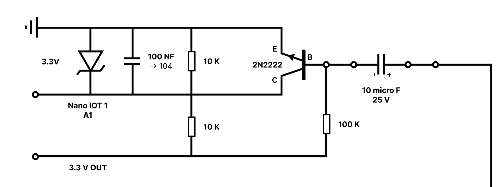
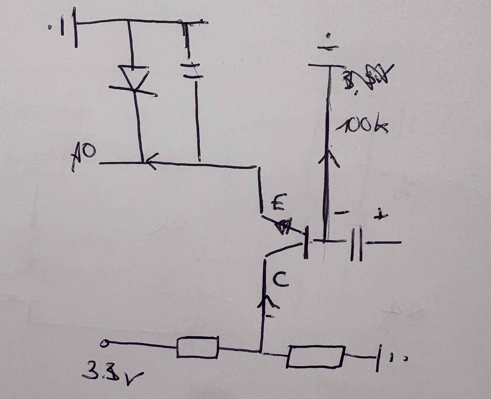
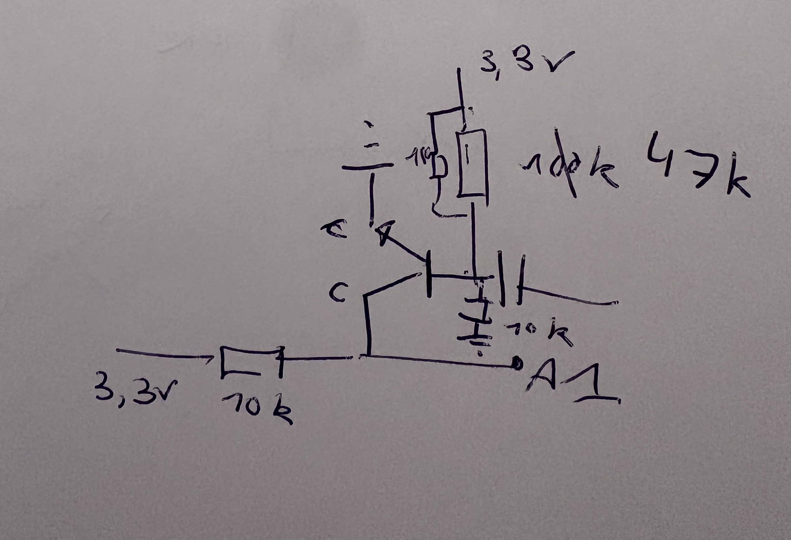
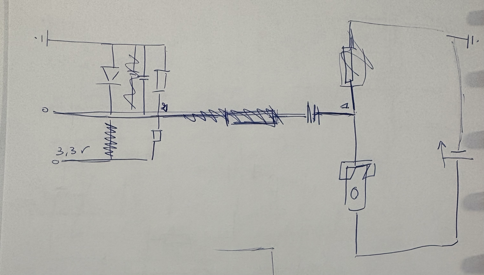
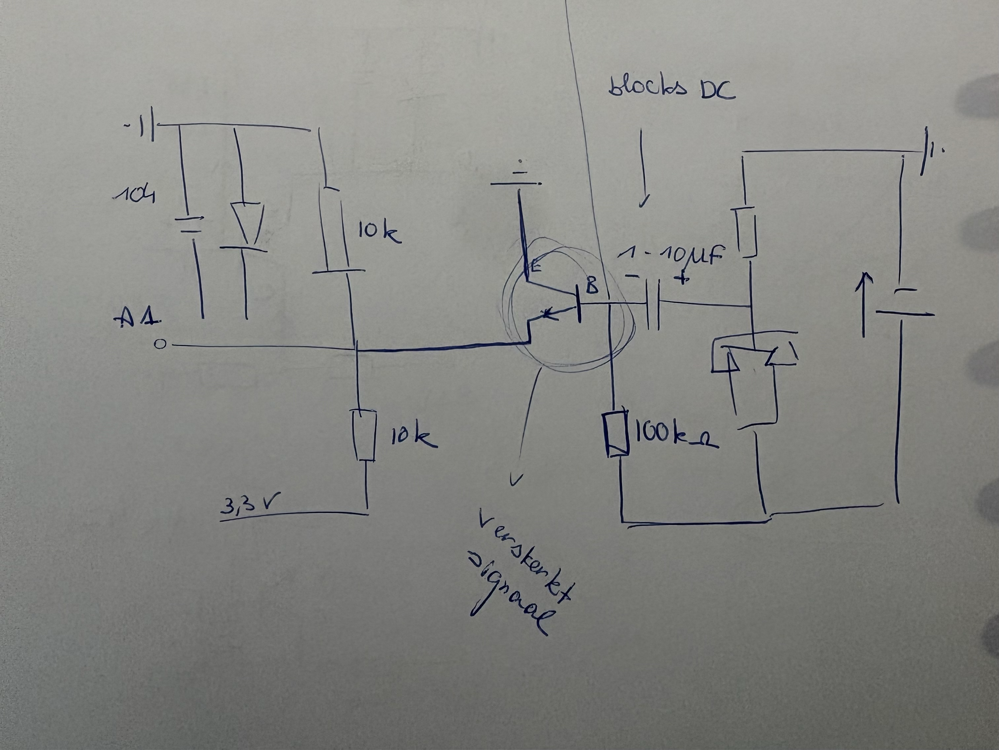

I had already figured out how to make the phones ring and play music using my Raspberry Pi. The next logical step was capturing audio from them.

I decided to do it the hard way. Instead of buying a simple USB soundcard, I attempted to use the Arduino Nano IoT boards I already had on hand.

## How it's supposed to work
To record a voice from a vintage phone, the sound has to travel through a few steps:

- **The Phone**: The microphone converts your voice into an electrical signal.
- **The Arduino**: Reads that analog signal and converts it into digital data (numbers).
- **The Connection**: The Arduino transmits these numbers to the Raspberry Pi.
- **The Pi**: The Pi collects the data and saves it as an audio file.

**The problem?**
Audio is unforgiving. If the data is even slightly delayed or packets are dropped, the recording becomes unintelligible.

## The Circuit
You can't simply plug a phone line into an Arduino—the voltage is far too high. I built a custom interface circuit to act as a bridge.

Here is what the main parts do:

- **The Capacitor (10µF)**: Acts as a high-pass filter. It blocks the heavy DC voltage from the phone line but lets the tiny "vibrations" of the voice pass through.
- **The Transistor (2N2222)**: Amplifies the weak voice signal so the Arduino can "hear" it clearly.
- **The Voltage Divider**: Two resistors that bias the signal to 1.65V. This allows the voice signal to oscillate up and down without hitting the "floor" (0V) or the "ceiling" (3.3V) of the Arduino's input range.
- **The Zener Diode**: A bodyguard. If a high-voltage spike surges through, this diode clamps it before it fries the Arduino.

## The Code
I quickly realized that the Arduino is actually quite slow when it comes to sound.

### 1. 1 sec of high-pitched sound
My first attempt resulted in just 1 second of high-pitched screeching. I tried streamlining every byte the moment it was ready, but the data bottlenecked immediately.

<audio controls src="/passionProject/sound/20260124-high-pitch-sound.wav"></audio>

Of course! If I couldn't stream music byte-by-byte from the Pi to the Arduino, why did I expect the reverse to work? I needed to find a balance: avoiding buffer overflows on the Arduino while ensuring the Pi wasn't overwhelmed by a flood of data packets.

### 2. Slow-Motion
I switched to sending data in chunks. Instead of transmitting single bytes, I flushed the entire serial buffer at once. I saw some progress, but my timing was off: a 10-second recording stretched into a minute of playback.

After further calibration and experimentation, I realized that even though the Arduino was sampling at 8000Hz, the USB serial overhead was significantly slowing it down.

By calibrationg everything right I got something where you could here my voice in the background.

<audio controls src="/passionProject/sound/20260124-sound-with-noise.wav"></audio>

Do you hear the noise, too? I have no idea where it came from—likely interference from a component or internal noise from the Arduino itself.

I tried everything to eliminate it: disabling Wi-Fi on the Arduino, rewiring the breadboard... eventually, I messed up the wiring so badly that all I got was a static sound.

## Conclusion
I’ve learned my lesson. The Arduino Nano IoT is excellent for simple control tasks, but it lacks the fidelity required for high-quality audio recording.

After a long day of debugging without success, I’ve decided to cut my losses. I’m giving up on the Arduino approach and buying a dedicated USB soundcard. Sometimes, the "easy" way is the right way!

