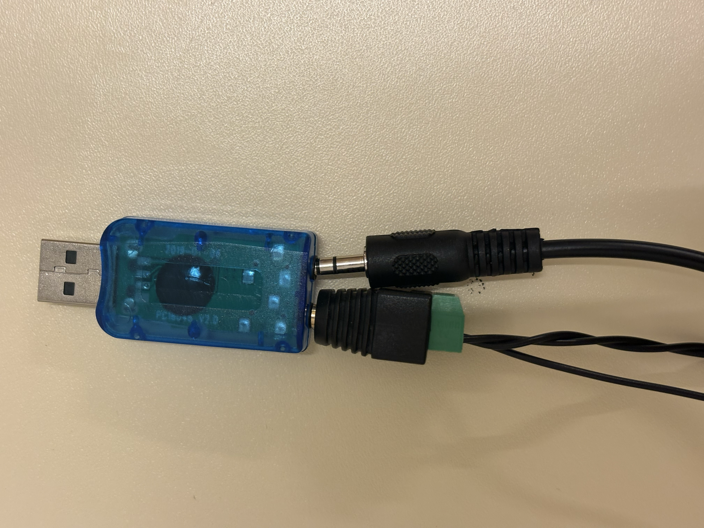

# The search for the right cable
Today I spent some time to find the right cable to connect my aux screw pin with my sound card. Because the two aux screws were not fitting together in the sound card. But after buying a male to female aux cable, I faced exactly the same problem as before...
At the end by removing some rubber, I was able to connect both the in and out at the same moment!

# Let's try to ring the bell
My whole DC circuit is working, my whole code for this part is working. So the only thing that I proposed to do was to connect the AC circuit together with the DC circuit.
After adding the double-sided relays and some new wiring and ... staring at what I did wrong (I forgot to connect the GND). My NC circuit, where the DC is flowing through worked again!

And also by opening the relays, my phone started to ring!

And then suddenly, my transformer burned...

## A burned transformer, what did I do wrong?
What I really did wrong, I genuinely don't know. Suddenly nothing was working anymore and my transformer was really really hot... Since I don't want to let it happen again with a new transformer, I started to try to find what I did wrong.

### 1. was my DC connected to the AC?
Since only my transformer was burned and nothing else this seemed as not a logical answer. If this would happen, my arduino probably died.

### 2. did I make a short circuit?
This could be possible since somethings weren't working. So maybe I accidentally created a short circuit

### 3. A big inductive spike?
Since I'm using relays close to the transformer and opening and closing them. They can create some inductive spikes.

### 4. I was just asking for too much current.
But I think the most logical answer is that I was just asking for too much current. Both my AC circuits and my DC circuit was connected to the same transformer output.