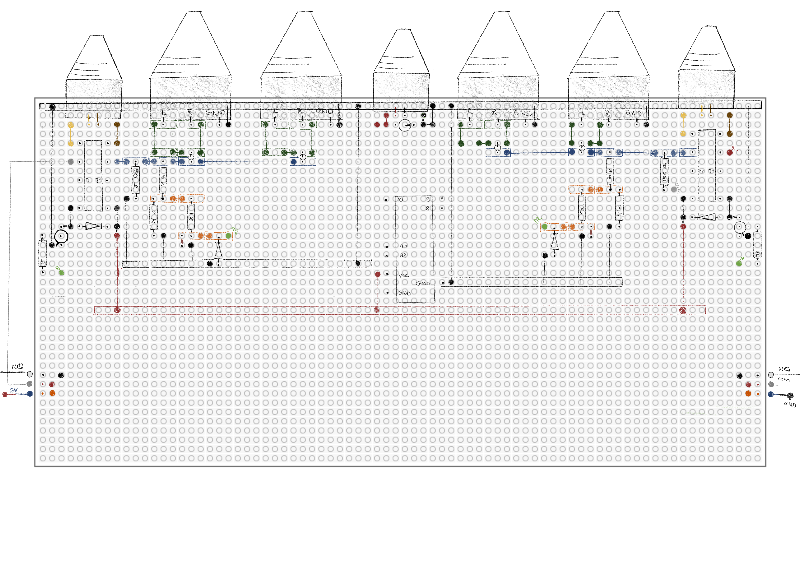
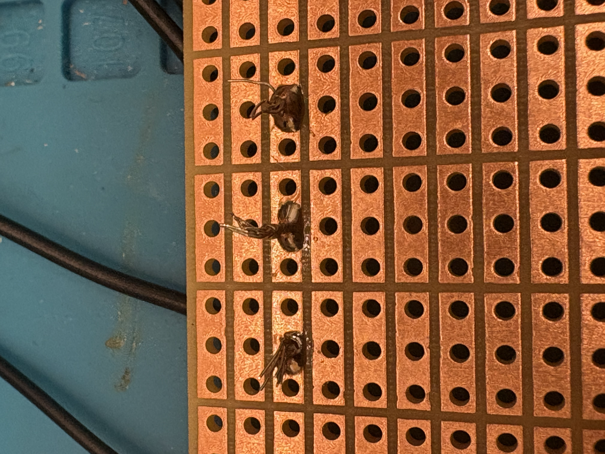

The breadboard is full. The wires are a mess. But most importantly: the whole circuit finally works.

With the prototype proven, it was time to make it permanent. I faced the classic maker’s dilemma: do I order a professional PCB, or do I build it myself?

## The PCB Dilemma
Simon sent me a <a href="https://www.eurocircuits.com" target="_blank">website</a> where students can get discounts on custom-printed circuit boards. It’s a tempting shortcut, but looking into it made me realize that designing a board isn't exactly that easy.

To do it right, I’d have to:
* Master KiCad (professional design software, now I just drawn everything in Figma 😅).
* Triple-check every trace to ensure no errors.
* Choose between dozens of finishes and thicknesses.

<iframe src="https://www.instagram.com/reel/DP3_TdZgAsX/embed/" width="270" height="480" frameborder="0" scrolling="no" allowtransparency="true" style="margin: 0 auto; display: block; max-width: 100%; padding: 32px 0">
</iframe>

It felt like a project in itself. While I definitely want to learn KiCad in the future, I didn't want to stall my progress now. So, I decided to go rogue and build the board myself on a tripod protoboard.

## Step 1: drawing
I looked for software to help me map out the components, but everything felt too "heavy." In the end, I went back to basics: pen and paper.

I spent way more time than I expected sketching out where every resistor, relay, and transistor should sit to keep the traces as clean as possible. It’s like a puzzle where the pieces are connected by copper. By the time I finished, I had what I thought was a perfect soldering plan.

*(Spoiler alert: my connections could be prettier, but for a first-timer, I was proud.)*

## Step 2: soldering
Then came the actual soldering. To be honest, the first few joints were a disaster. I haven’t touched a soldering iron in over 10 years.

A huge thank you to Ashley for stepping in and teaching me the basics of soldering. And after all I finally had a board with every connection in place.

I had a permanent circuit. I had a finished board... or so I thought.

Read the rest of my soldering adventure in Part 2!