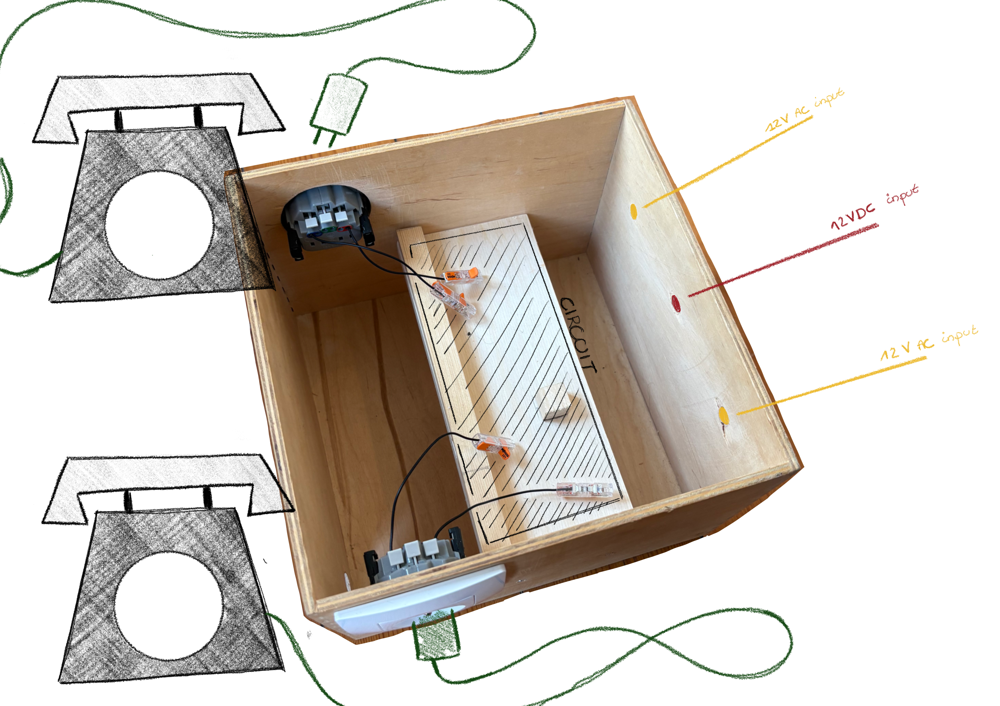
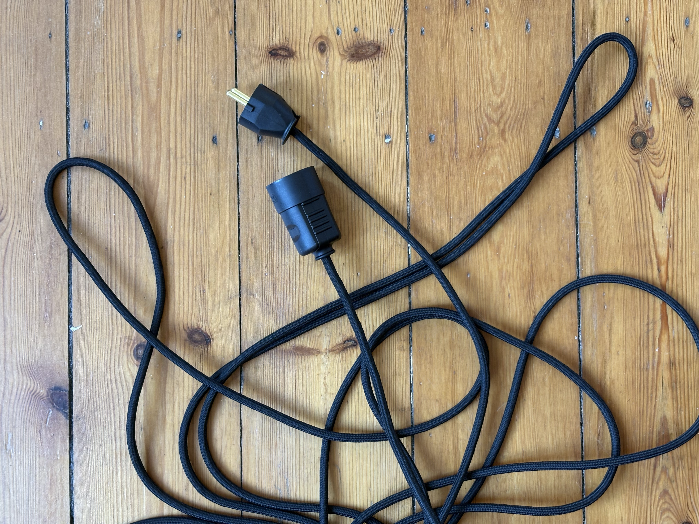

With the circuit fully soldered and (thankfully) no longer on fire, it was time to give the project a proper home.

## The Box
I built a custom enclosure to house all the wires and components. On the outside, I added three power inlets: one for the 12V DC logic and two for the AC circuits. Most importantly, I mounted two normal sockets on the side, allowing the vintage phones to be plugged in and swapped out easily.

## A custom extension cable
To make the system useful, the phones need to be far apart. I built a custom extension cable to bridge the distance between rooms.

Halfway through the process, I had a realization: I was essentially just building a standard extension cord. Would the project work with a normal, mega-long extension cable? Probably. But I didn't tested that out yet. But I don't see any reason why it shouldn't work.

## Testing!
It was time for the ultimate test. I placed Phone A in my bedroom and carried Phone B through the entire house to see if the signal would hold up. 

A big thank you to my dad for being my first customer and hopping on a test call with me. The conclusion? It works! The connection remained perfectly stable. The loudness didn't drop at all, which means the signal can handle the distance without any issues.

## But still a little quiet?
The only catch is that the volume is a bit low. There’s a good technical reason for this: safety. Back in the day, telephone lines were powered by 40V to 50V DC. Currently, I am running the handsets on just 12V DC to keep things safe and avoid any more transformer incidents. If I were to crank up the voltage, the sound would definitely be louder, but for now, I’m prioritizing a quiet conversation over another trip to the hardware store for a new power supply!