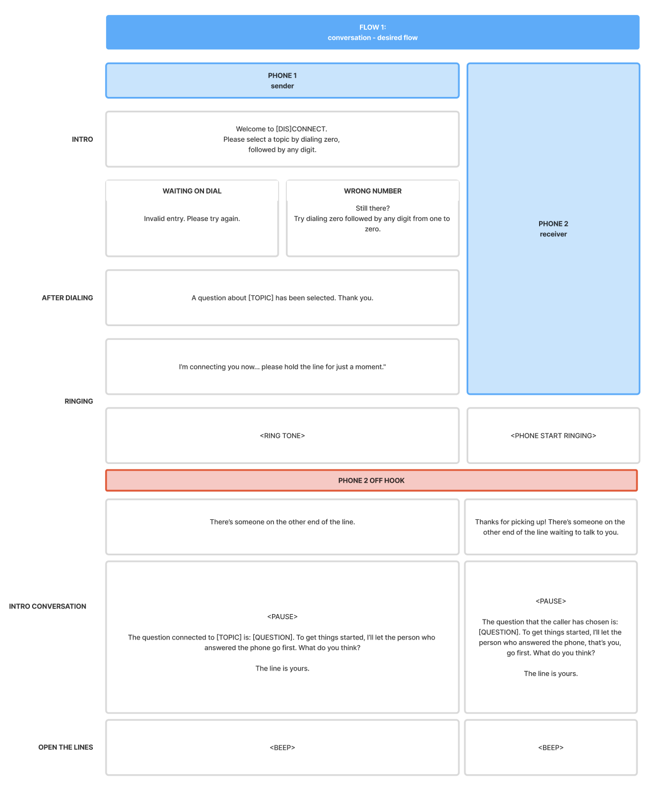
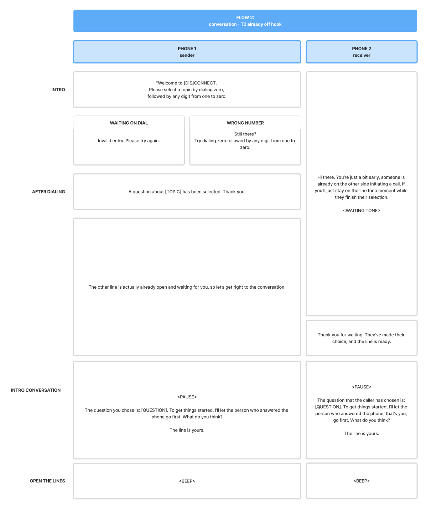
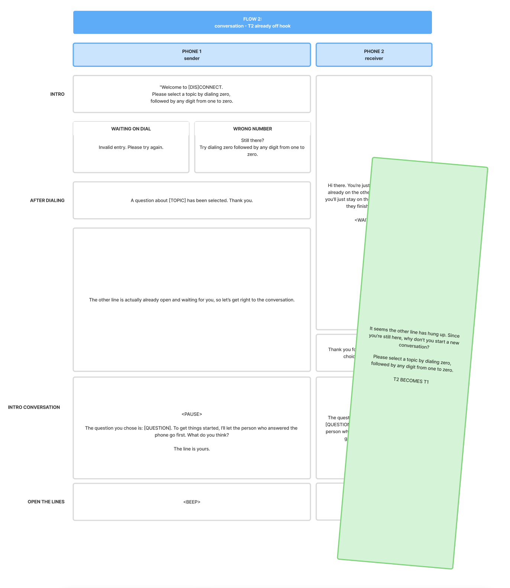
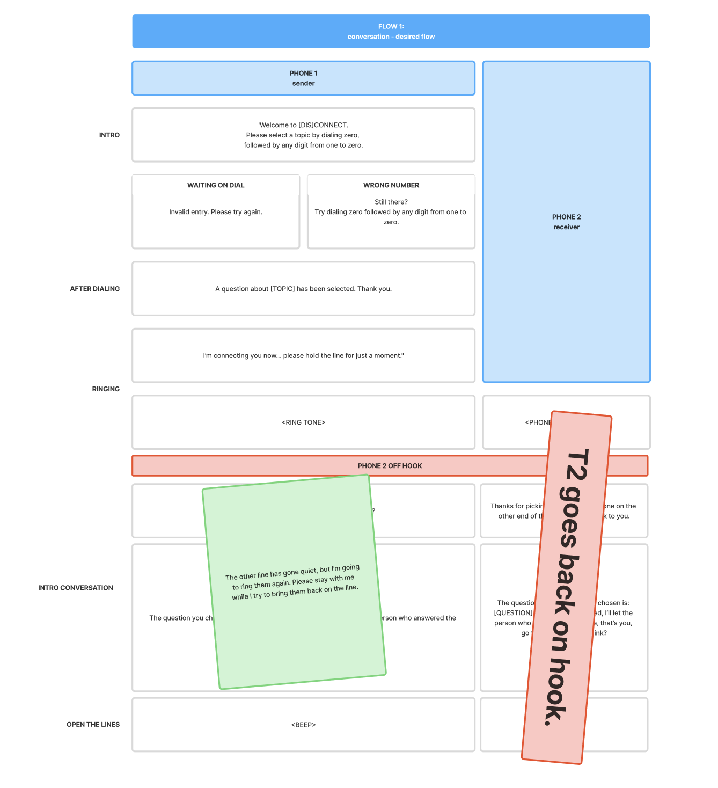
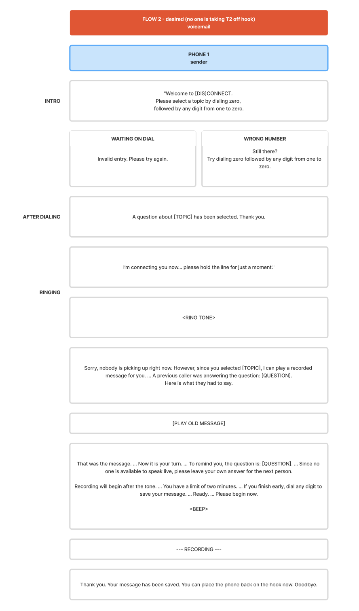
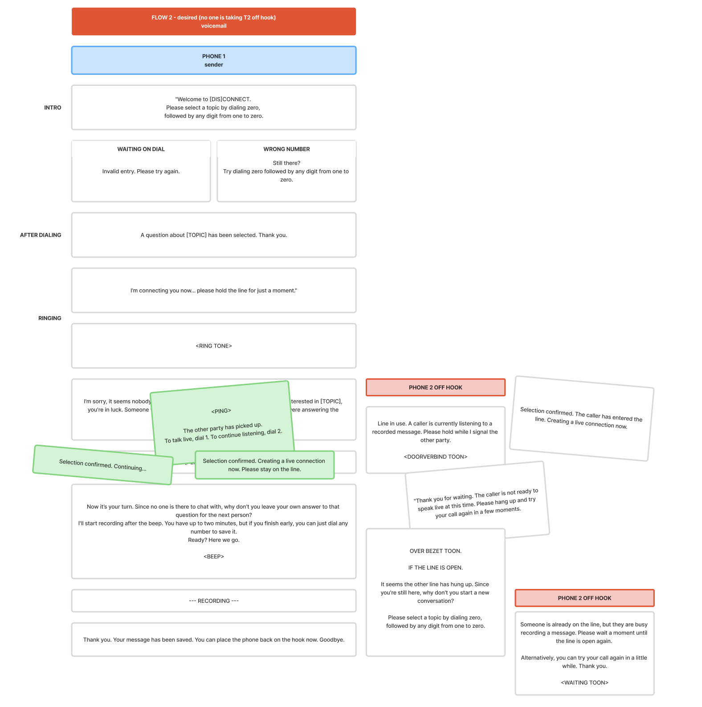

Today, I really, really needed to focus on the user flows, specifically, which feedback the user gets during a call and the questions they can choose from.

## Step 1: User flows
Before knowing which sentences were needed, I started by creating a user flow. But, pfff, I quit really fast. There are just too many options, and the interaction between the two phones is complex.

So, I changed my plan. I started writing scripts instead: a script and a flow for each scenario. I added the right sentences for the voice-over and tweaked the tone of voice multiple times.

After a while, I had this:

<div class="image-center">













</div>

This wouldn't be good enough to deliver to someone else, but since I'm working alone and most of it is already structured in my head, it was good enough for me.

## Step 2: Finding the right open questions
Since I have my flows, I really needed to start thinking about the questions. My whole concept stands or falls with the right open questions. I looked online for inspiration, wrote down 30 nice questions, and asked Gemini to structure them into categories. After selecting and narrowing them down, I had 10 questions left, each connected to a different theme:

1. **Origins**: What is your earliest childhood memory?
2. **Surplus**: If currency were no object, how would you spend your life?
3. **Milestones**: What accomplishment are you most proud of?
4. **Rituals**: How would you describe your perfect Sunday?
5. **Assets**: What is the most significant gift you have ever received?
6. **Coordinates**: If you could reside anywhere in the world, where would it be?
7. **Seminar**: If granted five minutes to present on any subject, what would it be?
8. **Euphoria**: What is the one thing that consistently makes you smile?
9. **Phobias**: How would you define your deepest personal fear?
10. **Blueprint**: What was your primary career ambition as a child?

## Step 3: Generating the sentences
With my questions and sentences ready, I started looking for a nice AI voice. After trying some sites, I created my own voice with ElevenLabs.

This was the description I gave:

```
Generate the audio in the style of a telephone switchboard announcement.
The sound should be really clear.
The tone should be clinical.
Avoid all modern 'assistant' cheerfulness.
Speak clearly and a little fast, with distinct pauses.
The delivery must be flat and monotone,
sounding like a pre-recorded system message rather than a live person.
```

## Step 4: Organizing sound files and coding
The last step of the day was organizing all the sound files. I decided to work with numbers and a variable—sender if the sound is linked to the sender’s phone, or receiver for the other—instead of using full descriptions. This makes sure the sounds are organized exactly like the flows in my code.